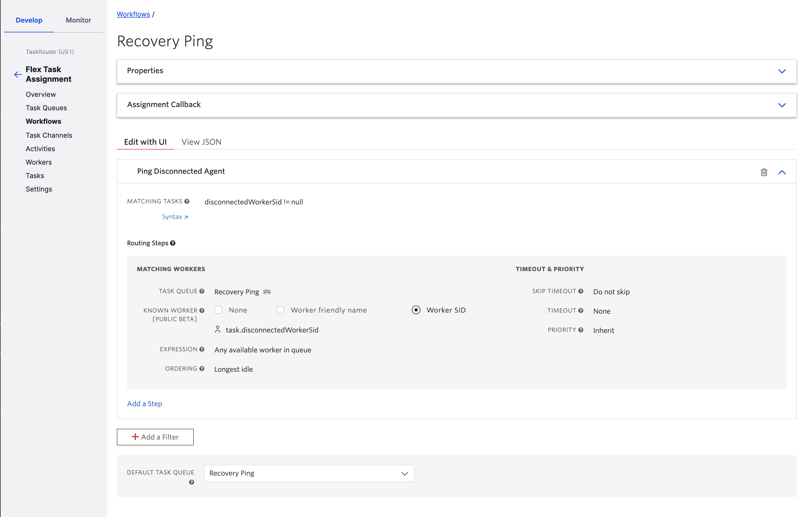
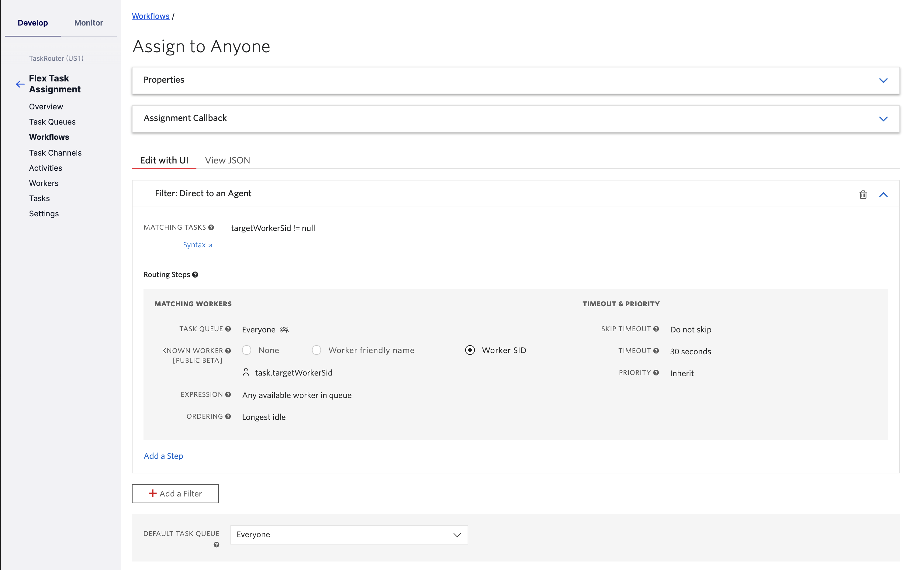

# Recover Non-Graceful Call Disconnects

It's well known that WebRTC doesn't play well with page refreshes. For example, if you refresh your browser when watching a YouTube video, it's impossible to keep viewing or hearing that video during the period where your browser is re-rendering the page and all of its components. That WebRTC socket connection is torn down, and needs to be setup all over again. YouTube optimizes the experience for you, by remembering your position in the video's timeline, and returns you there following the page fully reloading. 

The same applies if you refresh your browser while on an active WebRTC call in Flex. The socket connection is unavoidably torn down (because it only exists within the page that you have essentially just navigated away from). And that socket connection to Twilio's Voice infrastructure is equivalent to your cellphone's GPRS connection to a cell tower - in that it represents the actual phone call for the agent. If you sever that connection, the call is over. And when this happens, Flex will natively transition the associated call task to "wrapping", and the associated voice conference will also end (if only two participants). Not ideal from the point of view of the customer, or the agent.

But what if we could do what YouTube does - and bring the agent right back to where they were prior to the refresh? i.e. seamlessly reconnect the agent with the customer and any other parties that were in the conference - without the need for manual callbacks or lengthy interruptions to the customer-to-agent interaction. 

That's what this repository aims to offer. There's no escaping the fact that the agent's call leg will drop on a page refresh, but the customized Flex orchestration logic provided here will ensure the customer experiences minimal-to-no interruption while the agent's system recovers from the refresh (or whatever system issue required them to leave the conference non-gracefully).

The use case here is really to offer robust, exceptional quality of service to highly engagement-sensitive customers - such as emergency/SOS calls. 
## What's in the Box?
* Flex Plugin
    * Associates our Conference Status Callback Handler with any new voice tasks that arrive - which is the foundation for being able to react to non-graceful call termination
    * Registers the conference - for any newly accepted task - to our shared state model, for use by that Conference Status Callback Handler
    * Upon graceful call termination by the agent (i.e. clicking Hangup button), the shared state model is updated to reflect this (and the conference is explicitly ended if there are only two participants)
    * Upon a page reload (or any time the plugin loads), we look for any Wrapping call tasks that weren't gracefully disconnected from by the agent. If this scenario is detected, a UI-blocking modal dialog is presented - to show that the reconnection attempt is in progress, and also to block any ability for the agent to Wrapup/Complete the task
    * When the "Recovery Ping" task is received, the plugin auto-accepts it - which ultimately triggers our Taskrouter Event Stream Webhook to execute the delivery of the customer call via the "reconnect" call task, directly to the agent
    * Upon arrival of that reconnect call, the plugin auto-accepts it (which natively establishes a new conference between customer and agent)
    * Finally, the plugin will call our serverless function to dial in any remaining parties from the disconnected conference, and the modal dialog is closed - allowing the agent to resume the customer interaction
* Serverless Functions
    * Utility functions invoked from the Flex plugin to manipulate the conference, the participants, and the shared state (Sync Map in this implementation)
* Conference Status Callback Handler
    * Implemented as another Function, this event handler reacts to conference events and maintains shared state (Sync Map), and task attributes, in order to diagnose non-graceful agent call terminations.
    * Upon non-graceful agent call termination, an announcement is made to the remaining conference participant(s), and a "Recovery Ping" task is sent out to detect if the worker is reachable within a configurable TTL.
* Taskrouter Event Stream Webhook
    * Orchestrates the "reconnect" task based on the success/failure of the worker "ping" attempt
    * If ping is answered by the disconnected worker, the original customer from the disconnected conference is enqueued via Taskrouter - to the same worker
    * If ping hits it's TTL, the customer call is enqueued to the same workflow as the original call was handled on, and priority level is elevated

## Warm Transfers to other Agents
When there are multiple agents on the call, the non-graceful disconnect logic is not critical - since there is coverage for the customer if one agent drops unexpectedly (e.g. refreshes their page). Therefore, we only engage the non-graceful disconnect logic if it was the LAST agent on the call who disconnected-non-gracefully. This is easiest from a design persepective, and also from an end user-experience perspective.

If the remaining connected agent needs to get the disconnected agent back on the call, they could potentially warm transfer them back in. There is a risk that the disconnected agent might receive another call though - when they go available. This will be very tricky to orchestrate/automate through Flex UI - without Taskrouter/workflow logic. For example, shifting the worker into a dedicated activity that is an "available" activity, but one that is excluded from ACD calls.

## Things to be aware of
### Flex `endConferenceOnExit` Idiosyncracies 
Flex automatically updates `endConferenceOnExit` for the entire task reservation every time a conference update comes in (as well as on task acceptance - when the conference is created). And any time there are two or less active participants, it unavoidably sets `endConferenceOnExit` to `true`. This is a safeguard which is valid in most cases (just not this scenario where we are wanting the customer to remain connected to the Twilio conference on non-graceful agent disconnection).

We've worked around by essentially undoing the OOTB Flex conference participant update when it happens - but it does introduce split-second transient periods where `endConferenceOnExit` will be `true` for the two participants in conference (until our `participant-modify` event handler's explicit API call executes to apply our desired settings).

A Flex feature request has been logged - to ideally allow this native Flex behavior to be configurable or overridden.

### Use of Twilio Sync for State Model
For the purposes of PoC, this solution uses a Global Sync Map for modelling conference state between Flex and the various event handlers on the backend. Twilio Sync should not be used for this purpose in a Production environment, as it will not scale to any amount of significant call volume, and may result in rate limiting errors. A self-hosted database should be used for managing this state.

### Reporting Impact
We've added a `followed_by` attribute to the Insights `conversations` object within task attributes. Whenever the agent disconnects ungracefully, we set this to `followed_by = "Reconnect Agent"` - which is something you can then report on via Flex Insights.

This should be paired with other judicious use of `followed_by` - to allow you to report on transfers and other such call events. Refer to the [Flex Custom Insights Data Plugin](https://github.com/ldvlgr/custom-insights-data) for more.

## Pre-Requisites
* An active Twilio account with Flex provisioned. Refer to the [Flex Quickstart](https://www.twilio.com/docs/flex/quickstart/flex-basics#sign-up-for-or-sign-in-to-twilio-and-create-a-new-flex-project") to create one.
* npm version 5.0.0 or later installed (type `npm -v` in your terminal to check)
* Node.js version 12 or later installed (type `node -v` in your terminal to check)
* [Twilio CLI](https://www.twilio.com/docs/twilio-cli/quickstart#install-twilio-cli) along with the [Flex CLI Plugin](https://www.twilio.com/docs/twilio-cli/plugins#available-plugins) and the [Serverless Plugin](https://www.twilio.com/docs/twilio-cli/plugins#available-plugins). Run the following commands to install them:
  
  ```bash
  # Install the Twilio CLI
  npm install twilio-cli -g
  # Install the Serverless and Flex as Plugins
  twilio plugins:install @twilio-labs/plugin-serverless
  twilio plugins:install @twilio-labs/plugin-flex
  ```

## Twilio Serverless Functions and Assets
Some of the following setup steps will require Serverless Functions URLs, so we will deploy the Twilio Serverless Functions before proceeding with the remaining steps.

### Environment Variables
Login to your Twilio Console and capture the following account settings for use in serverless function environment variables:

| Variable Name | Description |
| :---------------- | :-------------------- |
| WORKSPACE_SID     | Your Flex Task Assignment workspace SID. Find this in the [TaskRouter Workspaces](https://www.twilio.com/console/taskrouter/workspaces) page. |
| SYNC_SERVICE_SID  | Your Sync "Default Service" SID. Find this in the [Sync Services](https://www.twilio.com/console/sync/services) page.

### Setup
1. Clone this repo to your local development environment
1. Change to the `serverless/recover-non-graceful-disconnects` directory and install the dependencies
    ```bash
    cd serverless/recover-non-graceful-disconnects

    npm install
    ```
1. Copy the `.env.sample` file to `.env`
    ```bash
    cp .env.sample .env
    ```
1. Edit `.env` and replace the environment variables with the values you captured in the "Twilio Account Settings" section above
    ```bash
    WORKSPACE_SID=WSXXXXXXXXXXXXXXXXXXXXXXXXXXXXXXXX
    SYNC_SERVICE_SID=ISXXXXXXXXXXXXXXXXXXXXXXXXXXXXXXXX
    ```

### Deploy
1. Verify your Twilio CLI is using the Twilio Flex account you want to test with. Run the following command and note which Twilio account has `Active` as `true`
    ```bash
    twilio profiles:list
    ```
1. If you need to change the active Twilio account, run the following command with the desired profile name
    ```bash
    twilio profiles:use PROFILE
    ```
1. If you do not yet have a Twilio CLI profile for the desired Twilio Flex account, run the following command to connect to that account and give it your desired profile name
    ```bash
    twilio profiles:create --profile=PROFILE
    ```
1. With your desired Twilio Flex account profile active in the Twilio CLI, change to the `serverless/recover-non-graceful-disconnects` directory and deploy the Twilio Serverless Functions and Assets
    ```bash
    cd serverless/recover-non-graceful-disconnects

    twilio serverless:deploy
    ```
1. When the deployment completes, copy the following Deployment Details that will be used in subsequent setup and configuration steps
    * `Domain`
    * `Functions` URL that ends in `/conference-status-handler`

## Twilio Account Configuration
This section outlines the required configuration in your Twilio Flex account for this sample solution to operate as intended. Login to your [Twilio Console](https://www.twilio.com/console) and follow the steps in each section below.

### TaskRouter TaskQueues
1. Navigate to TaskRouter -> Workspaces -> Flex Task Assignment -> Task Queues
1. Create a new TaskQueue called "Recovery Ping" that will handle 'ping' tasks for validating if an agent is reachable
    1. For the "Queue Expression" use the following:
        * `1 == 1`
        * This ensures any worker is eligible to receive calls in this queue. We will use Workflow worker expressions to only target the worker we're looking to validate is reachable.
    1. Leave all other configuration fields at their default values

### TaskRouter Workflows
1. Navigate to TaskRouter -> Workspaces -> Flex Task Assignment -> Workflows
1. Create a new Workflow called "Recovery Ping"
    1. Add a Filter named "Ping Disconnected Agent"
        1. Set the "Matching Tasks" expression to:
            * `disconnectedWorkerSid != null`
        1. Under the "Routing Step", set the following:
            * Task Queue to `Recovery Ping`
            * Known Worker to `Worker SID`
            * Task Field with Worker SID to `task.disconnectedWorkerSid`
            * Leave all other fields at their default values (no need for a timeout, as it will default to the task's TTL)
        1. Set the default Task Queue to the same `Recovery Ping` queue (though these tasks should always hit their TTL in the main routing step - assuming the task TTL is < the default 120s reservation timeout)
        
        
1. Navigate to TaskRouter -> Workspaces -> Flex Task Assignment -> Workflows
1. Modify your existing voice call Workflow(s) in order to add "direct to agent" routing logic (NOTE: you may have separate workflows per call type, so may need to repeat this)
    1. Add a Filter to the top of the workflow, named (e.g.) "Direct to an Agent"
        1. Set the "Matching Tasks" expression to:
            * `targetWorkerSid != null`
        1. Under the "Routing Step", set the following:
            * Task Queue to `Everyone` (Known Agent Routing will ensure sepcific worker gets the task; create a new queue if you need to see reconnects under a specific queue (e.g. for realtime monitoring))
            * Known Worker to `Worker SID`
            * Task Field with Worker SID to `task.targetWorkerSid`
            * Leave all other fields at their default values (you may want to set a timeout; definitely ensure "Do not skip" is chosen for Skip Timeout - because we need the reconnect task to enter the queue before we can safely close the original task)
            
            

### Taskrouter Event Stream Webhook

This is needed for the handling of the task events - in order to detect when the ping task is successful (`reservation.accepted`), or fails (`task.canceled`). It's also used to orchestrate the optimal timing for delivering the reconnect task back to the agent, by waiting for the `task-queue.entered` event - at which point it completes the disconnected task and so opens up voice channel capacity for the target worker.

1. Create a Taskrouter Event Stream webhook sink via CLI
    e.g.
    ```
    twilio api:events:v1:sinks:create --description 'Recover Non-Graceful Disconnects - TR Event Stream Webhook Sink' --sink-configuration '{"destination":"https://recover-non-graceful-call-disconnects-1234-dev.twil.io/task-event-handler","method":"POST","batch_events":true}' --sink-type webhook
    ```
    (replace the Domain with the value you copied in the Serverless Functions Deploy section above)

    NOTE the generated SID for the Sink
1. Create an Event Stream Subscription for the Webhook Sink
    e.g.
    ```
    twilio api:events:v1:subscriptions:create --description 'Recover Non-Graceful Disconnects - TR Event Stream Subscription to reservation.accepted, task.canceled, task-queue.entered' --sink-sid DGXXXXXXXXXXXXXXXXXXXXXXXXXXXXXXXX --types '{"type":"com.twilio.taskrouter.reservation.accepted","schema_version":1}' --types '{"type":"com.twilio.taskrouter.task.canceled","schema_version":1}' --types '{"type":"com.twilio.taskrouter.task-queue.entered","schema_version":1}'
    ```
    (populate the `--sink-sid` value with the SID generated in previous step)

## Twilio Flex Plugins
This section will go through the steps to prepare the Flex plugins in this sample solution for use in your development environment and deployment to your Flex account.

### Plugin Prep/Config


1. Navigate to the `plugin-recover-non-graceful-call-disconnects` directory, install dependencies, copy the `env.sample` and `public/appConfig.example.js` files
    ```bash
    cd ../../plugin-recover-non-graceful-call-disconnects

    npm install

    cp .env.sample .env

    cp public/appConfig.example.js public/appConfig.js
    ```
1. Edit the `.env` file and populate `REACT_APP_SERVERLESS_DOMAIN` with the Domain value you copied in the Serverless Functions Deploy section above
    ```bash
    REACT_APP_SERVERLESS_DOMAIN=recover-non-graceful-call-disconnects-1234-dev.twil.io
    ```

### Development

1. Navigate to `plugin-recover-non-graceful-call-disconnects` and start the plugin. 

    ```bash
    twilio flex:plugins:start
    ```

Once you login to Flex running on your local dev environment at `localhost:3000`, the Flex UI will load. At that point you are ready to test and further develop the Flex plugins.

### Deploy
Once you are happy with your plugin, you have to deploy then release the plugin for it to take affect on Twilio hosted Flex.

1. Verify your Twilio CLI is using the Twilio Flex account you want to test with. Run the following command and note which Twilio account has `Active` as `true`
    ```bash
    twilio profiles:list
    ```
1. If you need to change the active Twilio account, run the following command with the desired profile name
    ```bash
    twilio profiles:use PROFILE
    ```
1. Navigate to the `plugin-recover-non-graceful-call-disconnects` directory and deploy the plugin
    ```bash
    cd ../plugin-recover-non-graceful-call-disconnects

    twilio flex:plugins:deploy --major --changelog "Notes for this version" --description "Functionality of the plugin"
    ```
1. Create a release to enable the newly deployed plugin (the URL to use will be returned from the prior command)

After you've deployed and released your plugin, you can confirm it is enabled in the Flex Admin Plugins dashboard at https://flex.twilio.com/admin/plugins.

For more details on deploying your plugin, refer to the [Flex plugin deploy and release guide](https://www.twilio.com/docs/flex/developer/plugins/cli/deploy-and-release).

Note: Common packages like `React`, `ReactDOM`, `Redux` and `ReactRedux` are not bundled with the build because they are treated as external dependencies so the plugin will depend on Flex to provide them globally.

## Testing
Once the Twilio Serverless Functions and Assets are deployed, the account configurations are complete, and the plugin is either running in your local development environment or in your hosted Flex instance, you are ready to test the solution.
